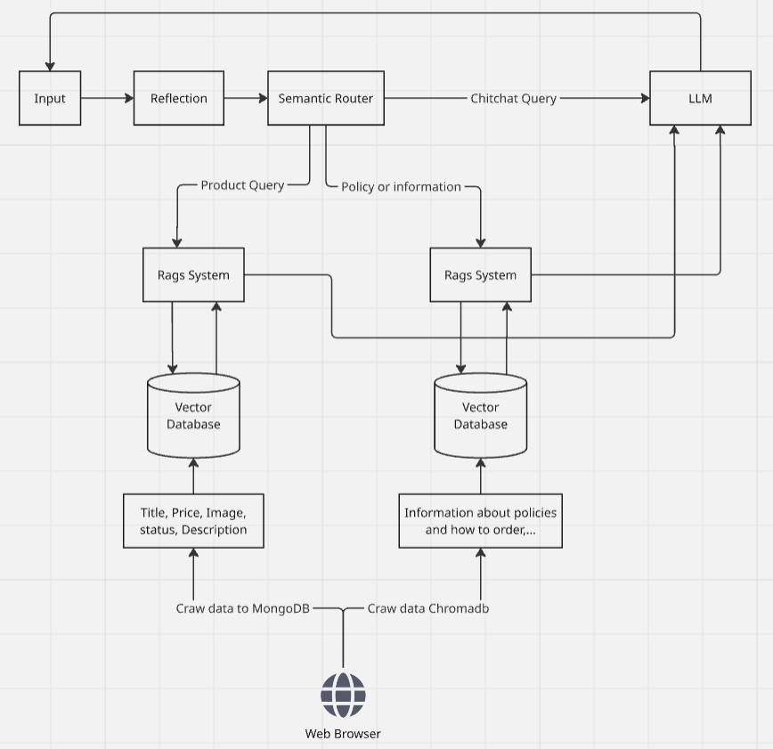

# Chatbot Rag System

## System Architecture

   
  <i>Achitecture</i>

* Reflection: Use LLM to paraphrase the current question based on the chat history.

* Semantic Router: Determines query type (chit-chat, product, or policy-related) and routes accordingly.

* RAG System: Handles product and policy queries by retrieving information from vector databases and generating relevant answers.

* LLM: Processes chit-chat queries and supports the RAG system in natural language generation.

* Vector Databases: Store embedded data such as product information (price, images, descriptions) and policy documents.

* Web Crawler: Gathers data from web sources.

## DEMO
* Deploy Frontend at: http://13.229.135.9:8501/Chat_Bot
* Deploy backend at: http://13.229.135.9:8000 
